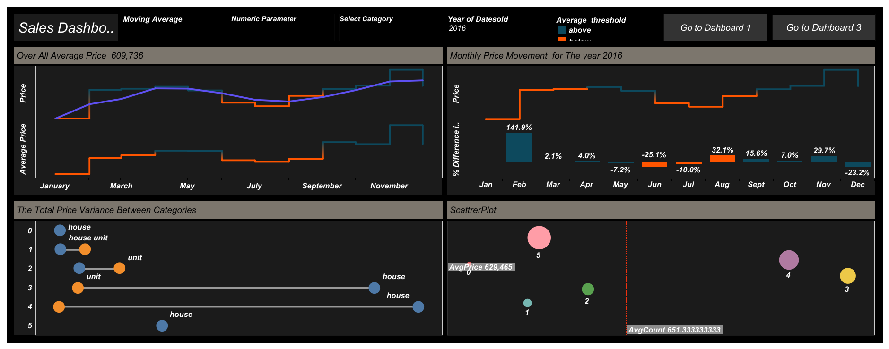

# ***Home Prices Analysis***

## *Overview*
*This project offers an in-depth analysis of Home Prices leveraging **Tableau tools**. Key business metrics and trends are visualized through a comprehensive dashboard. The insights derived facilitate data-driven decision-making, aiding business growth.*

## *To access the project online ,Click on the below link*

[*House_Prices_Analysis_Using_Tableau link*](https://public.tableau.com/views/HomePrices_17029104670670/Dashboard1?:language=en-GB&publish=yes&:sid=&:redirect=auth&:display_count=n&:origin=viz_share_link)

## *Aim*
*The primary goal is to provide actionable insights into the Home Prices, pinpointing areas for enhancement and growth through comprehensive analysis.*

## *Tools Utilized*
* *Tableau*

## *1st Dashboard -Main*

## *2nd Dashboard*

## *3nd Dashboard*

## *Conclusion*
*This project harnesses Tableau's capabilities to empower stakeholders with a dynamic platform for sales data analysis. The derived insights lead to informed decisions and refined sales strategies.*